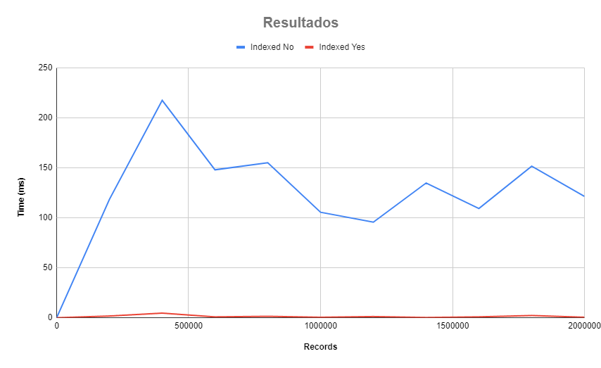

# Lab8.2
# Experimento 1:
## Ejemplo de plan de ejecucion:
### Ejemplo para 1 Millon de registros:
```sql
QUERY PLAN							
---------------------------------------------------------------------------------------------------------------------------							
Gather  (cost=1000.00..18564.05 rows=100 width=66) (actual time=101.111..105.577 rows=0 loops=1)							
Workers Planned: 2							
Workers Launched: 2							
->  Parallel Seq Scan on test_table  (cost=0.00..17554.05 rows=42 width=66) (actual time=63.437..63.438 rows=0 loops=3)							
Filter: (non_indexed_column ~~ '%query%'::text)							
Rows Removed by Filter: 333333							
Planning Time: 0.088 ms							
Execution Time: 105.593 ms							
(8 filas)							
							
QUERY PLAN							
---------------------------------------------------------------------------------------------------------------------							
Bitmap Heap Scan on test_table  (cost=596.77..971.03 rows=100 width=66) (actual time=0.442..0.442 rows=0 loops=1)							
Recheck Cond: (indexed_column ~~ '%query%'::text)							
->  Bitmap Index Scan on trgm_idx  (cost=0.00..596.75 rows=100 width=0) (actual time=0.441..0.441 rows=0 loops=1)							
Index Cond: (indexed_column ~~ '%query%'::text)							
Planning Time: 0.073 ms							
Execution Time: 0.465 ms							
(6 filas)							
```

## Grafico Final:



#Experimento 2:

## Ejemplo de plan de ejecucion:
### Para un consulta sin indexar

```sql
QUERY PLAN						
------------------------------------------------------------------------------------------------------						
Seq Scan on film  (cost=0.00..145.00 rows=446 width=109) (actual time=0.180..9.639 rows=318 loops=1)						
Filter: ((description ~~* '%man%'::text) OR (description ~~* '%woman%'::text))						
Rows Removed by Filter: 682						
Planning Time: 4.229 ms						
Execution Time: 9.664 ms						
(5 filas)						
```

### Para un consulta indexada
```sql
QUERY PLAN							
------------------------------------------------------------------------------------------------------							
Seq Scan on film  (cost=0.00..142.50 rows=238 width=109) (actual time=0.053..0.536 rows=239 loops=1)							
Filter: ('''man'' | ''woman'''::tsquery @@ indexado)							
Rows Removed by Filter: 761							
Planning Time: 0.353 ms							
Execution Time: 0.557 ms							
(5 filas)				
```
### Para una consulta con ranking topk = 2
```sql
QUERY PLAN						
------------------------------------------------------------------------------------------------------------------						
Limit  (cost=145.47..145.48 rows=2 width=113) (actual time=1.142..1.143 rows=2 loops=1)						
->  Sort  (cost=145.47..146.07 rows=238 width=113) (actual time=1.141..1.142 rows=2 loops=1)						
Sort Key: (ts_rank_cd(film.indexado	''man'' | ''woman'''::tsquery)) DESC					
Sort Method: top-N heapsort  Memory: 25kB						
->  Seq Scan on film  (cost=0.00..143.09 rows=238 width=113) (actual time=0.082..1.066 rows=239 loops=1)						
Filter: ('''man'' | ''woman'''::tsquery @@ indexado)						
Rows Removed by Filter: 761						
Planning Time: 0.277 ms						
Execution Time: 1.157 ms						
(9 filas)
```
